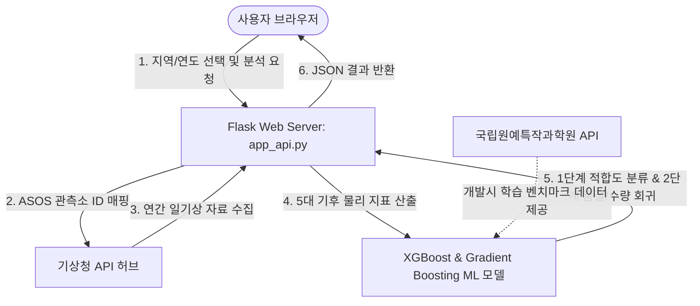

# 감귤 재배 기후 적합성 분석 시스템 기능 및 로직 분석서

본 문서의 작성자 및 저작권은 **세종기후AI연구소**에 있습니다. 본 시스템은 전국 226개 기초자치단체의 실시간 기상자료를 공공 API로부터 수집하고, 기계학습(Machine Learning) 알고리즘을 활용하여 감귤 재배 적합도 및 생산 품질을 분석/예측하는 서비스입니다.

---

## 1. 시스템 아키텍처 개요
본 시스템은 백엔드 API 서버(Flask)와 프론트엔드 대시보드(HTML5/CSS3/Vanilla JS)가 결합된 형태의 웹 서비스입니다. 깃허브(GitHub) 저장소 연동을 통해 렌더(Render) 클라우드 플랫폼에 CI/CD 자동화 배포가 적용되어 있습니다.

---

## 2. 세부 기능 및 로직 흐름 (Data Flow)

### 2.1. 기초자치단체-ASOS 관측소 매핑 로직
전국 226개 기초자치단체는 기상청 종관기상관측(ASOS) 지점과 매핑되어 있습니다.
* **매핑 테이블 (`MUNI_STN_MAP`)**: 각 시/군/구별 지리적 위치가 가장 인접한 ASOS 관측소의 ID 번호(예: 서울 종로구-`108`, 경기 수원시-`119`, 제주 제주시-`184`)로 1대1 매핑하여 실측 기상 통계를 신뢰성 있게 도출합니다.
* **정형화 필터링**: 관측 중단 지점이나 중복 표기를 제외한 정형화 리스트를 생성하여 `/municipalities` 엔드포인트를 통해 프론트엔드 드롭다운 메뉴로 실시간 제공합니다.

### 2.2. 기상청 실시간 API 수집 및 지표 산출 로직
지정한 지역과 연도 정보를 바탕으로 기상청 API 허브의 일자료 API(`kma_sfcdd3.php`)를 통해 **1월 1일부터 12월 31일까지의 365일분 일일 기상 데이터**를 수집합니다.
수집된 로우 데이터는 컬럼 파싱 과정을 통해 아래 **5대 핵심 기후 물리 지표**로 가공됩니다.

1. **한파일수 (Cold Wave Days)**:
   * **기준**: 일 최저기온이 **$-12.0^\circ\text{C}$ 이하**인 날의 누적 연간 일수.
   * **로직**: 감귤 나무의 세포벽이 파괴되는 동해(Freeze injury) 한계 기온인 $-12^\circ\text{C}$를 기준으로 연간 노출 일수를 계산합니다.
2. **고온스트레스 일수 (Heat Stress Days)**:
   * **기준**: 일 평균기온이 **$30.0^\circ\text{C}$ 이상**인 날의 누적 연간 일수.
   * **로직**: 광합성 효율 저하 및 생육 장해가 유발되는 고온 임계치를 도출합니다.
3. **유효적산온도 (GDD, Growing Degree Days)**:
   * **기준**: $GDD = \sum \max(T_{mean} - 10, 0)$
   * **로직**: 감귤 생육의 기본 하한 온도인 $10^\circ\text{C}$를 넘어서는 일평균기온의 연간 누적 합산 온도입니다.
4. **연강수량 (Annual Precipitation)**:
   * **기준**: 연간 일일 강수량의 단순 누적 총합 (mm).
5. **연일조시간 (Annual Sunshine Hours)**:
   * **기준**: 연간 일일 일조 시간의 단순 누적 총합 (시간).

### 2.3. 국립원예특작과학원 감귤 생육/품질 API 수집 및 처리 로직
감귤의 실제 생육 상태와 과실의 품질 지표(당산비) 데이터를 수집하기 위해 **국립원예특작과학원 감귤 생육/품질 정보 Open API**를 활용합니다.
* **연동 엔드포인트**: `http://apis.data.go.kr/1390804/Nihhs_Fruit_Citrus_GrwhInfo/citrusGrwnData`
* **이중 인코딩(Double Encoding) 우회 로직**: 
  * 공공데이터포털의 서비스 인증키는 `%` 문자가 포함된 인코딩된 상태로 발급되는 경우가 많아, 파이썬 `requests` 라이브러리의 `params` 인자로 전달하면 자동으로 `%`가 `%25`로 이중 인코딩되어 인증 오류(401)가 발생합니다.
  * **해결책**: 서비스 키를 API URL 뒤에 강제로 직접 결합하여 라이브러리의 자동 인코딩 메커니즘을 우회합니다.
    `request_url = f"{base_url}?serviceKey={service_key}"`
* **수집 및 파싱 로직 (`fetch_citrus_data.py`)**:
  1. **요청 규격**: `pageNo` (페이지 번호), `numOfRows` (조회 행 수)를 파라미터로 실어 호출합니다.
  2. **XML 데이터 파싱**: 수집된 XML 데이터를 파이썬 내장 `xml.etree.ElementTree` 모듈을 통해 파싱합니다.
  3. **핵심 데이터 필드 추출**:
     * `examYear`: 감귤 생육 조사를 실시한 대상 연도.
     * `areaName`: 조사 지역 명칭 (예: 제주 서귀포, 제주시 등).
     * `spcsName`: 감귤 품종명 (예: 온주밀감, 궁천조생 등).
     * `budDate` / `flwrDate`: 감귤 봄철 눈의 **발아일** 및 꽃의 **만개일** (기후 변화 모니터링용).
     * `brix` / `acid`: 감귤 과실의 **당도(Brix)** 및 **산도(%)** (품질 평가용).
* **AI 모델과의 논리적 연계**:
  * 기상청 API가 물리적인 기후 환경(입력값)을 제공하는 반면, 국립원예특작과학원 API는 감귤 생육의 결과물인 **생육 상태와 과실 품질(출력값)** 데이터를 제공합니다.
  * 수집된 당도와 산도 데이터는 본 시스템 2단계 회귀 모델의 핵심 예측 항목인 **예상 품질 점수**를 도출하기 위한 학습 모델 설계 및 통계 검증 데이터셋 구축의 기초 자료로 활용되었습니다.

---

## 3. 기계학습(ML) 모델 연동 및 예측 로직

### 3.1. 1단계: 적합성 등급 분류 (Classification)
* **알고리즘**: XGBoost 분류기 (`XGBClassifier`)
* **입력값**: [한파일수, 유효적산온도(GDD), 연강수량, 연일조시간]
* **출력값 및 클래스 분류**:
  * **`0` (재배 불가)**: 한파일수가 너무 잦거나 GDD 누적이 부족하여 감귤 재배가 불가능한 지역.
  * **`1` (시험 재배)**: 기후 변동에 따라 모니터링이 필요한 지역.
  * **`2` (상업 최적)**: 상업적으로 최적의 당도와 생산 수확량을 확보할 수 있는 지역.

### 3.2. 물리 지표 기준치 상세 매핑
사용자에게 친숙한 피드백을 주기 위해 분류 모델 예측과 별개로 농촌진흥청 감귤 재배 기준에 맞추어 지표별 상태를 매핑합니다.
* **한파일수**: Optimal $\le 2$일 (최적) / $3 \sim 9$일 (한계) / $\ge 10$일 (불가)
* **고온스트레스**: Optimal $0$일 (최적) / $1 \sim 5$일 (한계) / $\ge 6$일 (불가)
* **유효적산온도**: Optimal $\ge 2500$ (최적) / $2000 \sim 2499$ (한계) / $< 2000$ (불가)
* **연강수량**: Optimal $\le 1575\text{ mm}$ (최적) / $1576 \sim 1925\text{ mm}$ (한계) / $> 1925\text{ mm}$ (불가)
* **연일조시간**: Optimal $\ge 1928\text{ 시간}$ (최적) / $1571 \sim 1927\text{ 시간}$ (한계) / $< 1571\text{ 시간}$ (불가)

### 3.3. 2단계: 다중 출력 품질/수량 회귀 예측 (Multi-Output Regression)
1단계 분류 결과가 **시험 재배(1)** 또는 **상업 최적(2)** 지역으로 판단될 경우에만 실행되어 농가의 경영적 판단을 돕는 심화 지표를 예측합니다.
* **알고리즘**: `MultiOutputRegressor` 기반 `GradientBoostingRegressor`
* **예측 지표**:
  1. **예상 생산단수 (Yield)**: 10a(300평)당 생산 가능한 감귤 중량 (`kg/10a`).
  2. **예상 품질 점수 (Quality Score)**: 감귤연구소 공공데이터 기반 당산비(Brix/Acid) 조화를 계량화한 품질 점수 (10점 만점).
  3. **동해 피해 발생 확률 (%)**: 겨울철 갑작스러운 급저온에 의한 냉해 위험률.
  4. **착색 장해 위험도 (점수)**: 가을철 일조 부족이나 온도 편차 부족으로 인한 껍질의 착색도 평가 점수.
  5. **병해충 발생 강도 (점수)**: 여름철 다습한 환경에 따른 주요 진딧물, 검은점무늬병 등의 감염 위험 강도.

---

## 4. 프론트엔드 비동기 렌더링 로직

* **비동기 통신(AJAX - Fetch API)**: 
  * 사용자가 페이지에 진입하면 `/municipalities` 주소로부터 지역 데이터를 비동기 요청하여 화면 깜빡임 없이 셀렉트 박스 목록을 구성합니다.
  * 분석 폼을 제출(Submit)하면 화면 전환 없이 `/predict?muni=...&year=...` 엔드포인트를 호출합니다.
* **로딩 상태 관리 (UX)**:
  * 대용량 기상 데이터를 기상청 서버로부터 수집하고 분석 모델을 돌리는 과정에서 발생하는 지연 시간 동안 사용자 이탈을 막기 위해 **세련된 로딩 스피너 및 진행 상태 메시지**를 노출합니다.
* **동적 카드 컴포넌트 렌더링**:
  * 받아온 JSON 데이터를 가공하여 각 카드의 뱃지 색상을 최적(Green, `optimal`), 한계(Yellow, `limit`), 불가(Red, `impossible`) 클래스로 동적 매핑하여 발광 효과(Neon glow style)를 포함한 다크 테마 UI를 동적으로 생성합니다.
  * 1단계 재배 불가 지역의 경우 하단의 2단계 예측 지표 영역(`secondary-section`)을 자동으로 숨겨 오독을 방지합니다.
